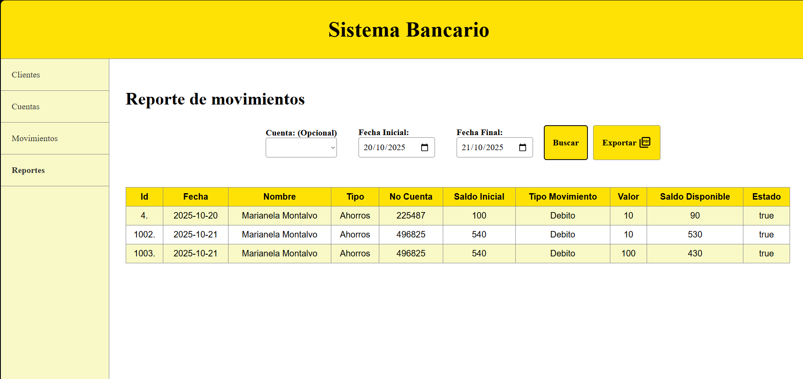
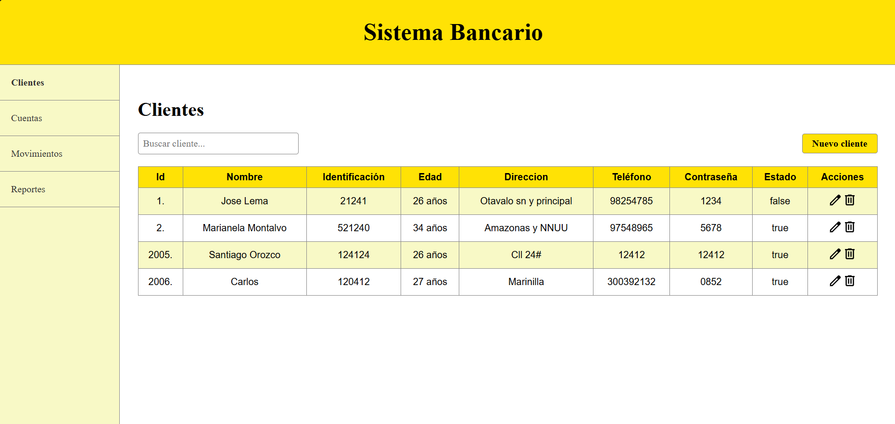
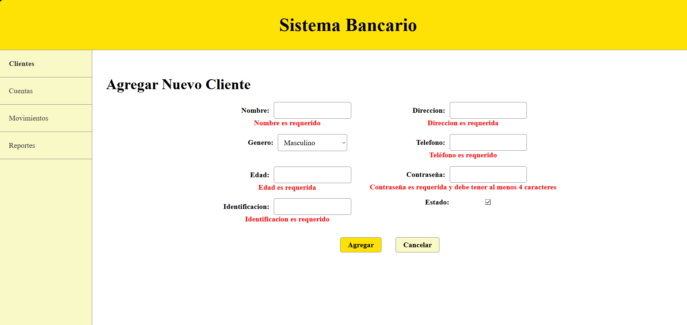
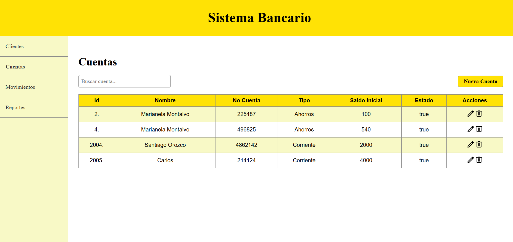
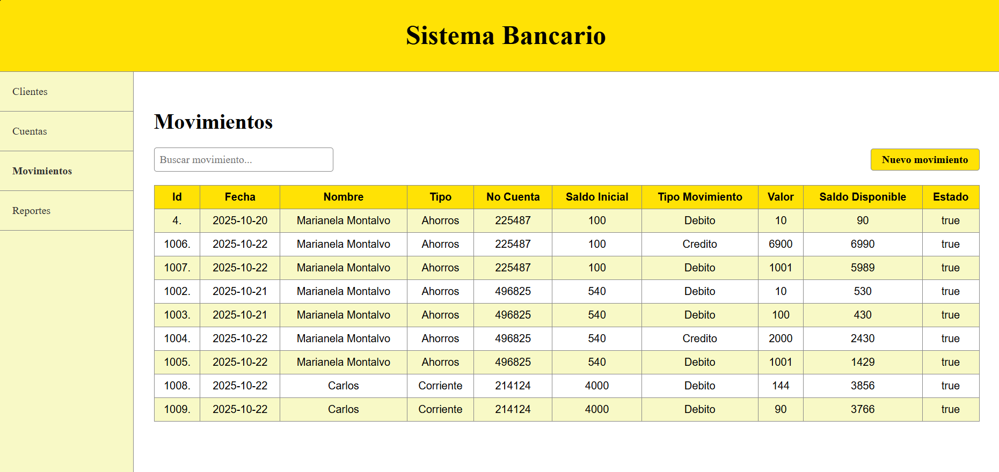
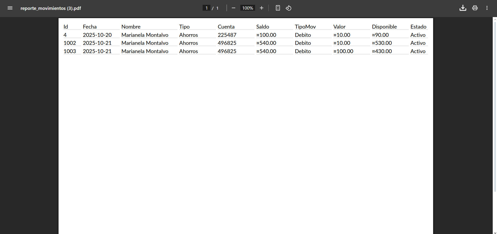

# BankSystem 🏦💻

**BankSystem** is a full-stack banking application built with **.NET 8 backend** and **Angular 12 frontend**, fully containerized with **Docker Compose**.  
It allows managing **clients, accounts, and movements**, as well as generating reports in PDF.



---

## ✨ Features

- 👥 Manage clients (CRUD)
- 💳 Manage bank accounts (CRUD)
- 📊 Record and view account movements
- 📝 Generate PDF reports of movements
- 🔐 JWT-based authentication
- 🏗 Modular architecture with separated backend layers
- 🐳 Fully containerized for easy deployment with Docker

---

## 🏗️ Project Structure

The backend follows Clean Architecture:

- `BankSystem.API` → API entry point with controllers and endpoints
- `BankSystem.Application` → DTOs, interfaces, and application logic  
- `BankSystem.Domain` → Core entities (Clients, Accounts, Movements)
- `BankSystem.Infrastructure` → Services, JWT generator, exceptions
- `BankSystem.Persistence` → Repositories and DbContext implementation

Frontend is an Angular 12 SPA located in `/BankSystem-Front`.

---

## 🛠 Tech Stack

- **Frontend**: Angular 12, Bootstrap
- **Backend**: ASP.NET Core 8, Clean Architecture
- **Database**: SQL Server + SSDT (Database project)
- **Auth**: JWT (JSON Web Tokens)
- **Containerization**: Docker + Docker Compose

---

## 🚀 Getting Started

### 🧩 Prerequisites

- [Docker Desktop](https://www.docker.com/products/docker-desktop)
- [Git](https://git-scm.com/downloads)
- SQL Server running on Windows
  - Make sure TCP/IP is enabled in SQL Server Configuration Manager

> No need to install .NET SDK or Node.js locally if using Docker.

---

### ⚙️ Database Setup

Before running the app, create the database:

1. Open SQL Server Management Studio (SSMS)
2. Connect to your local SQL Server instance
3. Open the file [Database/BaseDatos.sql](Database/BaseDatos.sql)
4. Execute the script to create the database, tables, and seed data

> This ensures the backend can connect to a ready-to-use database.

---

### ⚙️ Run the App with Docker

```bash
git clone https://github.com/yourusername/BankSystem.git
cd BankSystem
docker compose up --build
Frontend: http://localhost:4200
```

Backend Swagger: http://localhost:7114/swagger

🧪 API Testing with Postman
Open Postman
Import the collection: BankSystemAPI.postman_collection.json (located in the root of the project)

Set up the environment variable baseUrl:
Variable	Value
baseUrl	http://localhost:7114/api

Use the collection to test all endpoints:

Clients → CRUD endpoints
Accounts → CRUD endpoints
Movements → CRUD and report endpoints
Export → Generate PDF reports

You can also use variables for ids to test GET, PUT, DELETE requests dynamically.

## 🖼️ Screenshots
### 🔹 Clients Page


### 🔹 Add Client


### 🔹 Accounts Page


### 🔹 Movements Page


### 🔹 Generate Report


### 🔹 Report PDF

